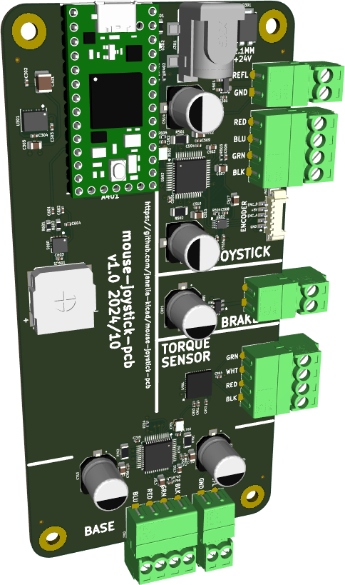

- [Repository Info](#orga1a6088)
- [Images](#org3d558c7)
- [Schematic](#orgbc6d7b6)
- [PCB](#org3f950dd)
- [Bill of Materials](#org1d80a5f)
- [Notes](#orga1039cb)
- [Development](#org57bd091)

    <!-- This file is generated automatically from metadata -->
    <!-- File edits may be overwritten! -->

# Repository Info

-   Project Name: mouse-joystick-pcb
-   Synopsis: Janelia Dudman lab PCB for the mouse joystick rig.
-   Documentation Version: 1.0.0
-   Pcb Version: 1.0
-   Enclosure Version: 1.0
-   Supplemental BOM Version: 1.0
-   Release Date: 2024-08-05
-   Creation Date: 2017-08-14
-   Kicad Version: 7.0.11
-   License: BSD-3-Clause
-   URL: <https://github.com/janelia-kicad/mouse-joystick-pcb>
-   Author: Peter Polidoro
-   Email: peter@polidoro.io
-   Copyright: 2024 Howard Hughes Medical Institute
-   References:
    -   <https://www.transducertechniques.com/rts-torque-sensor.aspx>
    -   <https://placidindustries.com/products/brakes/magnetic-particle-brakes/magnetic-particle-brake-b5z/>
    -   <https://www.newark.com/broadcom-limited/hedr-5421-ep111/encoder-incremental-2-ch/dp/58Y4773>
    -   <https://www.linengineering.com/products/stepper-motors/hybrid-stepper-motors/208-series/208-13-01/WO-208-13-01D>
    -   <https://www.pololu.com/product/2267>

# Images

# Schematic

# PCB

# Bill of Materials

## Board

| Item | Synopsis                                  | Manufacturer Part Number | Manufacturer                         | Quantity | Reference(s)                              | Package            |
|---- |----------------------------------------- |------------------------ |------------------------------------ |-------- |----------------------------------------- |------------------ |
| 1    | 50V 3.3uF                                 | FS32X335K500EGG          | PSA(Prosperity Dielectrics)          | 1        | C301                                      | 1210               |
| 2    | CAP CER 0.1UF 100V X5R                    | GRM155R62A104KE14D       | Murata Electronics                   | 8        | C302 C501 C601 C701 C801 C901 C1001 C1101 | 0402               |
| 3    | CAP CER 1UF 25V X5R                       | GRT155R61E105KE01D       | Murata Electronics                   | 2        | C303 C304                                 | 0402               |
| 4    | CAP CER 1UF 35V X5R                       | CL05A105KL5NRNC          | Samsung Electro-Mechanics            | 7        | C502 C602 C702 C802 C902 C1002 C1102      | 0402               |
| 5    | 50V 15A PowerDI-5 Super Barrier Rectifier | SBRT15U50SP5-13          | Diodes Incorporated                  | 1        | D301                                      | PowerDI-5          |
| 6    | DIODE SCHOTTKY 20V 1A                     | MBR120VLSFT1G            | onsemi                               | 1        | D401                                      | SOD-123FL          |
| 7    | DIODE ZENER 47V 1W                        | 1SMAF4756A               | Shikues                              | 7        | D501 D601 D701 D801 D901 D1001 D1101      | SMAF               |
| 8    | DIODE GEN PURP 400V 2A                    | ES2G                     | ShunYe                               | 7        | D502 D602 D702 D802 D902 D1002 D1102      | SMB                |
| 9    | CONN FFC FPC BOTTOM 10POS 1MM RA          | 1.0K-FX-10PWBG           | HDGC                                 | 7        | J501 J601 J701 J801 J901 J1001 J1101      | SMD P=1mm          |
| 10   | 100V 260mA N-Channel MOSFET               | 2SK1589-T1B-VB           | VBsemi Elec                          | 1        | Q301                                      | SOT-23             |
| 11   | 1PCSPChannel 60V 50A                      | 30P06-VB                 | VBsemi Elec                          | 1        | Q302                                      | TO-252-2           |
| 12   | RES SMD 1K OHM 1% 1/16W                   | RC0402FR-071KL           | YAGEO                                | 1        | R301                                      | 0402               |
| 13   | RES SMD 3.6K OHM 1% 1/16W                 | RM04JTN362               | TA-I Tech                            | 1        | R302                                      | 0402               |
| 14   | 1W 240m Surface Mount Resistor            | FRL2512JR240TS           | FOJAN                                | 7        | R501 R601 R701 R801 R901 R1001 R1101      | 2512               |
| 15   | RES SMD 100 OHM 1% 62.5mW                 | 0402WGF1000TCE           | UNI-ROYAL(Uniroyal Elec)             | 7        | R502 R602 R702 R802 R902 R1002 R1102      | 0402               |
| 16   | TERM BLOCK HDR 2POS 90DEG 5.08MM          | 1757242                  | Phoenix Contact                      | 1        | T301                                      | Push-Pull P=5.08mm |
| 17   | DC-DC 5V 600mA Output 3-65V Input         | TPSM365R6V5RDNR          | Texas Instruments                    | 1        | U301                                      | QFN-11(3.5x4.5)    |
| 18   | IC TRANSCEIVER HALF 1/1                   | MAX13431EETB+T           | Analog Devices Inc./Maxim Integrated | 7        | U501 U601 U701 U801 U901 U1001 U1101      | TDFN-10-EP(3x3)    |

## Supplemental

| Item | Synopsis                        | Manufacturer Part Number | Manufacturer    | Quantity | Cost  | Total |
|---- |------------------------------- |------------------------ |--------------- |-------- |----- |----- |
| 1    | TERM BLOCK PLUG 2POS STR 5.08MM | 1758364                  | Phoenix Contact | 1        | 1.63  | 1.63  |
| 2    | W5100S-EVB-PICO RP2040 W5100S   | W5100S-EVB-PICO          | WIZnet          | 1        | 9.95  | 9.95  |
|      | Supplemental BOM Version: 1.0   |                          |                 |          | Total | 11.58 |

# Notes

## Actuators

### Stepper Motors

1.  Big

    SOYO SY42STH38-1684A

2.  Little

    Lin Engineering WO-208-13-01D-RO

### Brake

Placid Industries B5Z-24-1R Magnetic Particle Brake

-   Current control 0-0.049 A at 24 V

## Sensors

### Torque Sensor

Transducer Techniques RTS-5

-   wheatstone bridge

### Encoder

Newark HEDR-5421-EP111

-   Two channel quadrature

### Limit Switches

MiSUMi D2F-01FL

-   Normally open or normally closed

# Development

## Install Guix

[Install Guix](https://guix.gnu.org/manual/en/html_node/Binary-Installation.html)

## Generate Output from KiCad

### Images

1.  3D Viewer

    Output directory: ../documentation/pcb
    
    -   pcb.png
    -   top.png
    -   bottom.png
    -   front.png
    -   back.png
    -   left.png
    -   right.png

2.  Trim

        make trimmed-images

3.  Schematic PDF

    File -> Plot
    
    Output directory: ../documentation/schematic
    
    Plot All Pages
    
    -   Output format PDF
    -   Page Size = Schematic size
    -   Plot drawing sheet
    -   Output mode = Color
    -   Color theme = KiCad Default
    -   Default line width = 0.006 in

4.  Schematic SVG

    File -> Plot
    
    Output directory: ../documentation/schematic
    
    Plot All Pages
    
    -   Output format SVG
    -   Page Size = Schematic size
    -   Plot drawing sheet
    -   Output mode = Color
    -   Color theme = Solarized Light
    -   Default line width = 0.012 in

5.  PCB SVG

    Add Edge.Cuts, holes, and dimensions to User.Drawings
    
    File -> Plot
    
    Output directory: ../documentation/pcb
    
    -   Plot format SVG
    -   Include Layers
        -   User.Drawings
        -   F.Silkscreen
        -   B.Silkscreen
        -   F.Fab
        -   B.Fab
    -   Plot on All Layers
        -   Edge.Cuts
    -   Plot footprint values
    -   Plot reference designators
    -   SVG Options
        -   Precision = 4
        -   Output mode = color
    
        make cropped-svg

### Fabrication Files

1.  Gerbers

    File -> Fabrication Outputs -> Gerbers (.gbr)
    
    Output directory: ../documentation/fabrication/gerbers
    
    Include Layers:
    
    -   F.Cu
    -   F.Paste
    -   F.Silks
    -   F.Mask
    -   F.Fab
    -   B.Cu
    -   B.Paste
    -   B.Silks
    -   B.Mask
    -   B.Fab
    -   Edge.Cuts - (contain the board outline/cutouts.)
    -   In1.Cu, In2.Cu … - (needed for 4/6 layer designs.)
    
    Options:
    
    -   Select Plot reference designators, otherwise designators will not appear on silkscreen layers.
    -   Select Check zone fills before plotting
    -   Select Use Protel filename extensions, this is recommended as JLCPCB prefers Protel filename extensions.
    -   Select Subtract soldermask from silkscreen, this ensures no silkscreen on pads.
    -   Coordinate format 4.6 unit mm

2.  Drill and Map Files

    Output directory: ../documentation/fabrication/gerbers
    
    Options:
    
    -   Excellon drill file format
    -   Check Use alternate drill mode for "Oval Holes Drill Mode".
    -   Check Absolute for "Drill Origin".
    -   Check Millimeters for "Drill Units".
    -   Check Decimal format for "Zeros Format".
    -   Gerber X2 map file format
    
    Zip gerber files
    
        zip gerbers.zip gerbers/*

3.  BOM

    Generate BOM from schematic editor using blank command line to create bom xml file.

4.  POS

    File -> Fabrication Outputs -> Component Placement (.pos)
    
    Output directory: ../documentation/fabrication/
    
    Settings:
    
    -   Format = CSV
    -   Units = Millimeters
    -   Files = Single file for board
    -   Do not use drill/place file origin
    
    Modify pos files:
    
    -   Ref -> Designator
    -   PosX -> Mid X
    -   PosY -> Mid Y
    -   Rot -> Rotation
    -   Side -> Layer

5.  Step

    File -> Export -> Step
    
    Output directory: ../documentation/3dmodels/pcb.step
    
    -   Drill/place file origin
    -   Overwrite old file
    -   Standard Board outline chaining tolerance

## Edit metadata.org

    make metadata-edits

## Tangle metadata.org

    make metadata

## Edit project

    make kicad-edits
    exit
