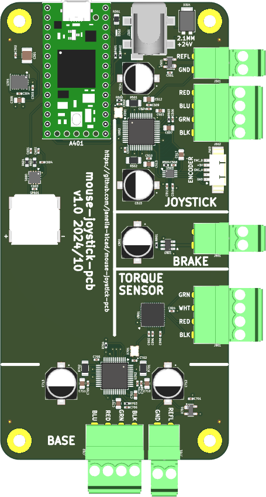
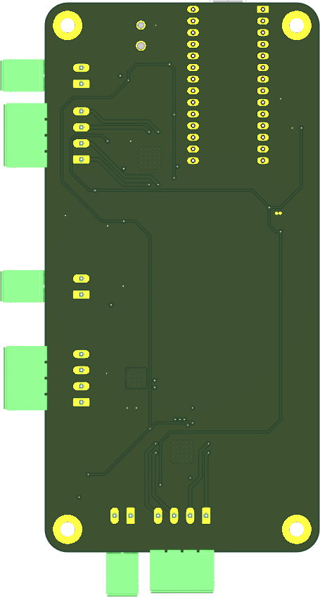
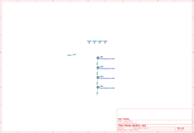
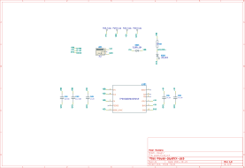
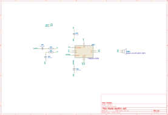
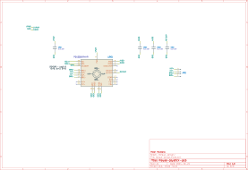
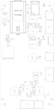

- [Repository Info](#org14d0c53)
- [Images](#org9544d27)
- [Schematic](#org6749648)
- [PCB](#org534e4a7)
- [Bill of Materials](#org1c01f95)
- [Notes](#org21dc098)
- [Development](#org81ab678)

    <!-- This file is generated automatically from metadata -->
    <!-- File edits may be overwritten! -->


<a id="org14d0c53"></a>

# Repository Info

-   Project Name: mouse-joystick-pcb
-   Synopsis: Janelia Dudman lab PCB for the mouse joystick rig.
-   Documentation Version: 1.0.0
-   Pcb Version: 1.0
-   Enclosure Version: 1.0
-   Supplemental BOM Version: 1.0.0
-   Release Date: 2024-10-24
-   Creation Date: 2017-08-14
-   Kicad Version: 7.0.11
-   License: BSD-3-Clause
-   URL: <https://github.com/janelia-kicad/mouse-joystick-pcb>
-   Author: Peter Polidoro
-   Email: peter@polidoro.io
-   Copyright: 2024 Howard Hughes Medical Institute
-   References:
    -   <https://www.transducertechniques.com/rts-torque-sensor.aspx>
    -   <https://placidindustries.com/products/brakes/magnetic-particle-brakes/magnetic-particle-brake-b5z/>
    -   <https://www.newark.com/broadcom-limited/hedr-5421-ep111/encoder-incremental-2-ch/dp/58Y4773>
    -   <https://www.linengineering.com/products/stepper-motors/hybrid-stepper-motors/208-series/208-13-01/WO-208-13-01D>
    -   <https://www.pololu.com/product/2267>


<a id="org9544d27"></a>

# Images






<a id="org6749648"></a>

# Schematic

[./documentation/schematic/mouse-joystick-pcb.pdf](./documentation/schematic/mouse-joystick-pcb.pdf)













<a id="org534e4a7"></a>

# PCB





<a id="org1c01f95"></a>

# Bill of Materials


## Board

| Item | Synopsis                                  | Manufacturer Part Number | Manufacturer                         | Quantity | Reference(s)                                                                                        | Package           |
|---- |----------------------------------------- |------------------------ |------------------------------------ |-------- |--------------------------------------------------------------------------------------------------- |----------------- |
| 1    | CONN HDR 14POS 0.1 GOLD PCB               | PPPC141LFBN-RC           | Sullins Connector Solutions          | 1        | A401                                                                                                |                   |
| 2    | 50V 3.3uF                                 | FS32X335K500EGG          | PSA(Prosperity Dielectrics)          | 1        | C301                                                                                                | 1210              |
| 3    | CAP CER 0.1UF 100V X5R                    | GRM155R62A104KE14D       | Murata Electronics                   | 20       | C302 C501 C502 C504 C505 C508 C509 C510 C511 C516 C701 C702 C704 C705 C708 C709 C901 C902 C903 C904 | 0402              |
| 4    | CAP CER 1UF 25V X5R                       | GRT155R61E105KE01D       | Murata Electronics                   | 2        | C303 C304                                                                                           | 0402              |
| 5    | CAP CER 47UF 10V X5R                      | CGA0805X5R476M100MT      | HRE                                  | 3        | C305 C507 C707                                                                                      | 0805              |
| 6    | CAP CER 0.022UF 100V X7R                  | GCM188R72A223KA37D       | Murata Electronics                   | 2        | C503 C703                                                                                           | 0603              |
| 7    | CAP CER 0.47UF 35V X5R                    | GRT155R6YA474KE01D       | Murata Electronics                   | 2        | C506 C706                                                                                           | 0402              |
| 8    | CAP CER 2.2UF 100V X7T 0805               | GRM21BD72A225KE01L       | Murata Electronics                   | 5        | C512 C513 C517 C710 C711                                                                            | 0805              |
| 9    | CAP ALUM 100UF 20% 50V SMD                | EEEHAH101UAP             | Panasonic Electronic Components      | 5        | C514 C515 C712 C713 C801                                                                            | SMD D8xL10.2mm    |
| 10   | CAP CER 0.22UF 25V X6S                    | GRT155C81E224KE01D       | Murata Electronics                   | 3        | C601 C602 C604                                                                                      | 0402              |
| 11   | CAP CER 1UF 35V X5R                       | CL05A105KL5NRNC          | Samsung Electro-Mechanics            | 1        | C603                                                                                                | 0402              |
| 12   | 50V 15A PowerDI-5 Super Barrier Rectifier | SBRT15U50SP5-13          | Diodes Incorporated                  | 1        | D301                                                                                                | PowerDI-5         |
| 13   | LED RED CLEAR CHIP SMD                    | APHHS1005SURCK           | Kingbright                           | 1        | D302                                                                                                | 0402              |
| 14   | DC Power Jack 2.5A 24V 2.1MM              | DC-005-2.5A-2.0-SMT      | XKB Connection                       | 1        | J301                                                                                                | SMD               |
| 15   | TERM BLOCK HDR 2POS 90DEG 3.5MM           | 1844210                  | Phoenix Contact                      | 3        | J501 J701 J801                                                                                      | Plugin P=3.5mm    |
| 16   | TERM BLOCK HDR 4POS 90DEG 3.5MM           | 1844236                  | Phoenix Contact                      | 3        | J502 J702 J901                                                                                      | Push-Pull P=3.5mm |
| 17   | CONN HEADER SMD R/A 5POS 1.25MM           | 0532610571               | MOLEX                                | 1        | J503                                                                                                | SMD               |
| 18   | RA73F 2A 2K32 0.1% 5K RL                  | RA73F2A2K32BTD           | TE Connectivity Passive Product      | 1        | R301                                                                                                | 0805              |
| 19   | RES SMD 1.8K OHM 5% 100mW                 | ERJ2GEJ182X              | PANASONIC                            | 4        | R401 R402 R505 R704                                                                                 | 0402              |
| 20   | 0.36 250mW Current Sense Resistor         | RL1206FR-070R36L         | YAGEO                                | 2        | R501 R502                                                                                           | 1206              |
| 21   | RES SMD 10 OHM 1% 62.5mW                  | RC0402FR-0710RL          | YAGEO                                | 2        | R503 R703                                                                                           | 0402              |
| 22   | RES 200K OHM 1% 62.5mW                    | 0402WGF2003TCE           | UNI-ROYAL(Uniroyal Elec)             | 1        | R504                                                                                                | 0402              |
| 23   | RES SMD 40k OHM 1% 100mW                  | SCR0603F40K              | VO                                   | 2        | R601 R602                                                                                           | 0603              |
| 24   | 0.12 750mW Current Sense Resistor         | KRL1632E-M-R120-F-T5     | SUSUMU                               | 2        | R701 R702                                                                                           | 1206              |
| 25   | RES 30 OHM 1% 62.5mW                      | CR0402FF30R0G            | LIZ Elec                             | 1        | R801                                                                                                | 0402              |
| 26   | SPEAKER 8OHM 700MW                        | KLJ-01304T-08R07W        | KELIKING                             | 1        | SP601                                                                                               |                   |
| 27   | DC-DC 5V 600mA Output 3-65V Input         | TPSM365R6V5RDNR          | Texas Instruments                    | 1        | U301                                                                                                | QFN-11(3.5x4.5)   |
| 28   | IC SWITCH DEBOUNCER                       | MAX6816EUS+T             | Analog Devices Inc./Maxim Integrated | 2        | U501 U701                                                                                           | SOT-143           |
| 29   | IC MTR DRV BIPOLAR 5.5-46V                | TMC5130A-TA              | Analog Devices Inc./Maxim Integrated | 2        | U502 U702                                                                                           | TQFP-48-EP(7x7)   |
| 30   | IC TRANSLTR BIDIRECTIONAL 2 CHAN          | LSF0102DCUR              | Texas Instruments                    | 1        | U503                                                                                                | VSSOP-8-0.5mm     |
| 31   | IC AMP CLASS AB MONO 1.7W                 | TPA6204A1DRBR            | Texas Instruments                    | 1        | U601                                                                                                | QFN-8-EP(3x3)     |
| 32   | IC LED DRVR LIN PWM 200MA                 | BCR421UE6327             | Infineon Technologies                | 1        | U801                                                                                                | SC-74-6           |
| 33   | IC SIGNAL COND ANLG                       | PGA305ARHHR              | Texas Instruments                    | 1        | U901                                                                                                | VQFN-36-EP(6x6)   |
| 34   | XTAL OSC XO 16MHZ 3.3V HCMOS SMD          | ECS-2520S33-160-FN-TR    | ECS Inc.                             | 2        | X501 X701                                                                                           | SMD2520-4P        |


## Supplemental

| Item | Synopsis                         | Manufacturer Part Number | Manufacturer         | Quantity | Cost  | Total |
|---- |-------------------------------- |------------------------ |-------------------- |-------- |----- |----- |
| 1    | AC/DC DESKTOP ADAPTER 24V 65W    | SDI65-24-UC-P5           | CUI Inc.             | 1        | 29.26 | 29.26 |
| 2    | TEENSY 4.0 (HEADERS)             | DEV-16997                | SparkFun Electronics | 1        | 28.50 | 28.50 |
| 3    | CBL USB2.0 A PLG-MCR B PLG 3.28' | 102-1492-BL-F0100        | CNC Tech             | 1        | 6.06  | 6.06  |
| 4    | TERM BLOCK PLUG 4POS STR 3.5MM   | 1840382                  | Phoenix Contact      | 3        | 6.27  | 18.81 |
| 5    | TERM BLOCK PLUG 2POS STR 3.5MM   | 1840366                  | Phoenix Contact      | 3        | 3.83  | 11.49 |
| 6    | PICOBLADE 5 CIRCUIT 300MM        | 0151340503               | Molex                | 1        | 5.18  | 5.18  |
| 7    | Supplemental BOM Version: 1.0.0  |                          |                      |          | Total | 99.30 |


<a id="org21dc098"></a>

# Notes


## Actuators


### Stepper Motors

1.  Big

    SOYO SY42STH38-1684A

2.  Little

    Lin Engineering WO-208-13-01D-RO


### Brake

Placid Industries B5Z-24-1R Magnetic Particle Brake

-   Current control 0-0.049 A at 24 V


## Sensors


### Torque Sensor

Transducer Techniques RTS-5

-   wheatstone bridge


### Encoder

Newark HEDR-5421-EP111

-   Two channel quadrature


### Limit Switches

MiSUMi D2F-01FL

-   Normally open or normally closed


<a id="org81ab678"></a>

# Development


## Install Guix

[Install Guix](https://guix.gnu.org/manual/en/html_node/Binary-Installation.html)


## Generate Output from KiCad


### Remove previous versions

```sh
rm -rf ./documentation/3dmodels/* && rm -rf ./documentation/bom/* && rm -rf ./documentation/fabrication/* && rm -rf ./documentation/pcb/* && rm -rf ./documentation/schematic/*pcb
```


### Images

1.  3D Viewer

    Output directory: ../documentation/pcb
    
    -   pcb.png
    -   top.png
    -   bottom.png
    -   front.png
    -   back.png
    -   left.png
    -   right.png

2.  Trim

        make trimmed-images

3.  Schematic PDF

    File -> Plot
    
    Output directory: ../documentation/schematic
    
    Plot All Pages
    
    -   Output format PDF
    -   Page Size = Schematic size
    -   Plot drawing sheet
    -   Output mode = Color
    -   Color theme = KiCad Default
    -   Default line width = 0.006 in

4.  Schematic SVG

    File -> Plot
    
    Output directory: ../documentation/schematic
    
    Plot All Pages
    
    -   Output format SVG
    -   Page Size = Schematic size
    -   Plot drawing sheet
    -   Output mode = Color
    -   Color theme = Solarized Light
    -   Default line width = 0.012 in

5.  PCB SVG

    Add Edge.Cuts, holes, and dimensions to User.Drawings
    
    File -> Plot
    
    Output directory: ../documentation/pcb
    
    -   Plot format SVG
    -   Include Layers
        -   User.Drawings
        -   F.Silkscreen
        -   B.Silkscreen
        -   F.Fab
        -   B.Fab
    -   Plot on All Layers
        -   Edge.Cuts
    -   Plot footprint values
    -   Plot reference designators
    -   SVG Options
        -   Precision = 4
        -   Output mode = color
    
        make cropped-svg


### Fabrication Files

1.  Gerbers

    File -> Fabrication Outputs -> Gerbers (.gbr)
    
    Output directory: ../documentation/fabrication/gerbers
    
    Include Layers:
    
    -   F.Cu
    -   F.Paste
    -   F.Silks
    -   F.Mask
    -   F.Fab
    -   B.Cu
    -   B.Paste
    -   B.Silks
    -   B.Mask
    -   B.Fab
    -   Edge.Cuts - (contain the board outline/cutouts.)
    -   In1.Cu, In2.Cu … - (needed for 4/6 layer designs.)
    
    Options:
    
    -   Select Plot reference designators, otherwise designators will not appear on silkscreen layers.
    -   Select Check zone fills before plotting
    -   Select Use Protel filename extensions, this is recommended as JLCPCB prefers Protel filename extensions.
    -   Select Subtract soldermask from silkscreen, this ensures no silkscreen on pads.
    -   Coordinate format 4.6 unit mm

2.  Drill and Map Files

    Output directory: ../documentation/fabrication/gerbers
    
    Options:
    
    -   Excellon drill file format
    -   Check Use alternate drill mode for "Oval Holes Drill Mode".
    -   Check Absolute for "Drill Origin".
    -   Check Millimeters for "Drill Units".
    -   Check Decimal format for "Zeros Format".
    -   Gerber X2 map file format
    
    Zip gerber files
    
        zip ./documentation/fabrication/gerbers.zip ./documentation/fabrication/gerbers/*

3.  BOM

    Generate BOM from schematic editor using blank command line to create bom xml file.

4.  POS

    File -> Fabrication Outputs -> Component Placement (.pos)
    
    Output directory: ../documentation/fabrication/
    
    Settings:
    
    -   Format = CSV
    -   Units = Millimeters
    -   Files = Single file for board
    -   Do not use drill/place file origin
    
    Modify pos files:
    
    -   Ref -> Designator
    -   PosX -> Mid X
    -   PosY -> Mid Y
    -   Rot -> Rotation
    -   Side -> Layer

5.  Step

    File -> Export -> Step
    
    Output directory: ../documentation/3dmodels/pcb.step
    
    -   Drill/place file origin
    -   Overwrite old file
    -   Standard Board outline chaining tolerance


## Edit metadata.org

    make metadata-edits


## Tangle metadata.org

    make metadata


## Edit project

    make kicad-edits
    exit
